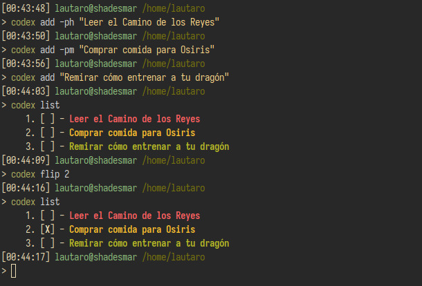

---

<div align = "center">

# Codex
Codex es una herramienta sencilla de terminal para manejar tareas desde la consola. 

**Secciones del README:** [Opciones](#Opciones) - [Descripción](#Descripción) - 
<!-- [Instalación](#Instalación) -->




</div>

---

## Descripción
El programa nace porque quería tener una lista de tareas siempre a mano. El mismo seguirá en desarrollo siempre y cuando se me vayan ocurriendo mejoras.

Codex está escrito en Rust y se apoya en librerías como:
- [`Clap`](https://docs.rs/clap/latest/clap/).
- [`csv`](https://docs.rs/csv/latest/csv/).
- [`Anyhow`](https://docs.rs/anyhow/latest/anyhow/).
- [`Colored`](https://docs.rs/colored/latest/colored/).
- [`Serde`](https://docs.rs/serde/latest/serde/).

Codex sigue la [especificación XDG a la hora de definir directorios base](https://specifications.freedesktop.org/basedir-spec/basedir-spec-latest.html).

## Opciones
### Comandos
Por el momento Codex viene con tres comandos: **'add'**, **'list'**, **'flip'**, **'remove'** y **'help'**.

- **add** añadirá una tarea (las cuales pueden tener tres ordenes de prioridad: High, Medium y Low) a un archivo `tasks.csv`:
``` bash
    # Las opciones High, Medium y Low pueden abreviarse con h, m o l respectivamente.
    codex add -p medium "Comprar pan"
    codex add -ph "Leer El Camino de los Reyes"
```
- **list** mostrará por pantalla, en orden de mayor prioridad a menor, las tareas presentes es `tasks.csv`. También puede elegirse determinadas prioridades: 
``` bash
    codex list
    codex list -p medium 
    codex list -ph
```
- **flip** permite cambiar el estado de una tarea de incompleta a completa, indicando el número de la tarea en el listado: 
``` bash
    codex flip 10
```

- **remove** permite borrar una tarea, indicando el número de la tarea en el listado: 
``` bash
    codex remove 10
```

- **help** mostrará por pantalla un mensaje de ayuda para cada sub-comando.
``` bash
    codex help 
    codex help add 
    codex help print
    codex help flip 
    codex help remove
```

<!-- ## Instalación -->
<!-- ### Cargo -->
<!-- Si ya tenés instalado y configurado Rust, podés instalarlo usando: -->
<!-- ``` -->
<!-- cargo install codex -->
<!-- ``` -->
