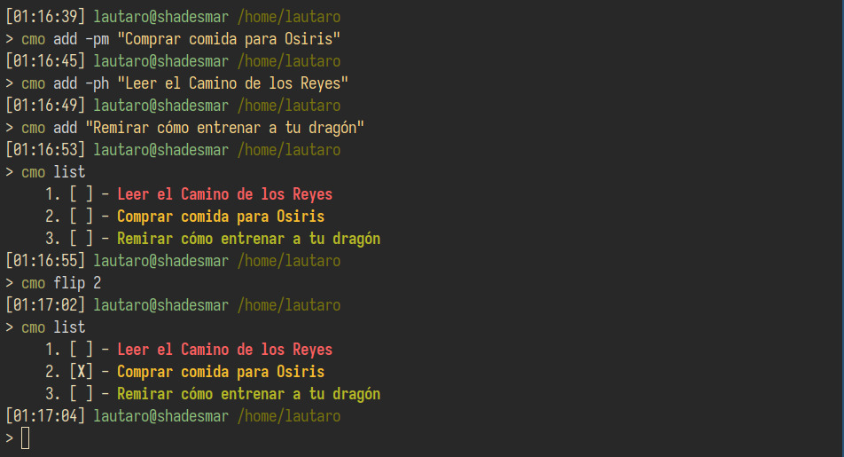

---

<div align = "center">

# cmo
cmo is a simple cli for managing tasks directly in the terminal.

**English** |  [Español](docs/readme/readme_es.md) 

**README Sections:** [Options](#Options) - [Description](#Description) - [Installation](#Installation)




</div>

---

## Description
`cmo` is an informal abbreviation for the Spanish phrase _casi me olvido_ (I almost forgot).

The program is born because I wanted to have a task list always at hand. It will continue to be developed as long as I come up with improvements.

cmo is written in Rust and heavily relies on libraries such as:
- [`Clap`](https://docs.rs/clap/latest/clap/).
- [`csv`](https://docs.rs/csv/latest/csv/).
- [`Anyhow`](https://docs.rs/anyhow/latest/anyhow/).
- [`Colored`](https://docs.rs/colored/latest/colored/).
- [`Serde`](https://docs.rs/serde/latest/serde/).

`cmo` follows the [XDG base directory specification](https://specifications.freedesktop.org/basedir-spec/basedir-spec-latest.html).

## Options
### Commands
At the moment `cmo` comes with five commands: **'add'**, **'list'**, **'flip'**, **'remove'** y **'help'**.

- **add** will add a task (which van have three priority levels: High, Medium y Low) to a `tasks.csv` file:
``` bash
    # The options High, Medium y Low can be abbreviated as h, m or l respectively.
   $ cmo add -p medium "Buy bread"
   $ cmo add -ph "Read the Way of Kings"
```
- **list** will display on the screen, in order from highest to lowest priority, the tasks present in `tasks.csv`. Specific priorities can also be chosen: 
``` bash
   $ cmo list
   $ cmo list -p medium 
   $ cmo list -ph
```
- **flip** allows changing the status of a task from incomplete to complete or vice versa, indicating the task number in the listing: 
``` bash
   $ cmo flip 10
```

- **remove** allows removing a task, indicating the task number in the listing: 
``` bash
   $ cmo remove 10
```

- **help** will display a help message for each sub-command:
``` bash
   $ cmo help 
   $ cmo help add 
   $ cmo help list
   $ cmo help flip 
   $ cmo help remove
```

## Installation
### Cargo
If you already have [Rust](https://www.rust-lang.org/) installed and configured, you can install it using:
```
$ cargo install cmo
```
